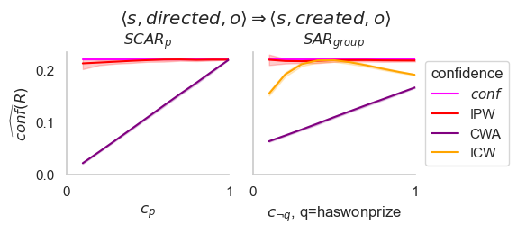
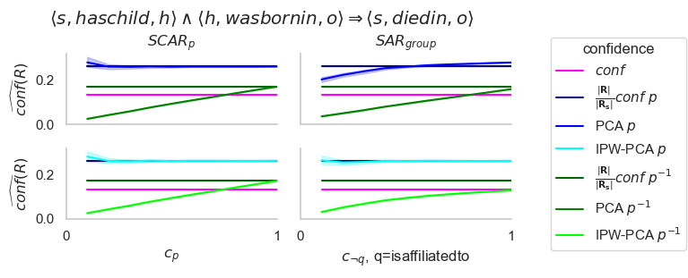
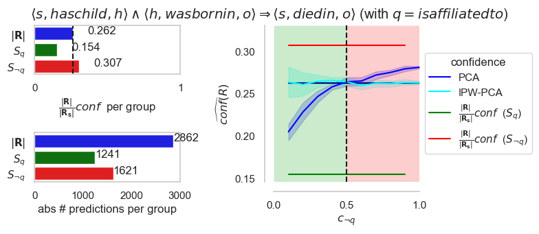

# Unifying Knowledge Base Completion with PU Learning to Mitigate the Observation Bias

Source code related to the [AAAI22](https://aaai.org/Conferences/AAAI-22/):

> Unifying Knowledge Base Completion with PU Learning to Mitigate the Observation Bias. 
> Jonas Schouterden, Jessa Bekker, Jesse Davis, Hendrik Blockeel. 

## Table of Contents

* [Abstract](https://github.com/ML-KULeuven/KBC-as-PU-Learning#abstract)
* [Installation](https://github.com/ML-KULeuven/KBC-as-PU-Learning#installation)
* [Notebooks](https://github.com/ML-KULeuven/KBC-as-PU-Learning#notebooks)
* [Generating the images in the paper](https://github.com/ML-KULeuven/KBC-as-PU-Learning#generating-the-images-in-the-paper)
* [Preparation of the "ideal" Yago3-10 KB](https://github.com/ML-KULeuven/KBC-as-PU-Learning#preparation-of-the-ideal-yago3_10-kb)

## Abstract
The following is the abstract of our paper:

> Methods for Knowledge Base Completion (KBC) reason about
a knowledge base (KB) in order to derive new facts that should
be included in the KB. This is challenging for two reasons.
First, KBs only contain positive examples. This complicates
model evaluation which needs both positive and negative ex-
amples. Second, those facts that were selected to be included
in the knowledge base, are most likely not an i.i.d. sample of
the true facts, due to the way knowledge bases are constructed.
In this paper, we focus on rule-based approaches, which tradi-
tionally address the first challenge by making assumptions that
enable identifying negative examples, which in turn makes it
possible to compute a rule’s confidence or precision. However,
they largely ignore the second challenge, which means that
their estimates of a rule’s confidence can be biased. This paper
approaches rule-based KBC through the lens of PU learning,
which can cope with both challenges. We make three contri-
butions. (1) We provide a unifying view that formalizes the
relationship between multiple existing confidences measures
based on (i) what assumption they make about and (ii) how
their accuracy depends on the selection mechanism. (2) We in-
troduce two new confidence measures that can mitigate known
biases by using propensity scores that quantify how likely a
fact is to be included the KB. (3) We show through theoret-
ical and empirical analysis that taking the bias into account
improves the confidence estimates, even when the propensity
scores are not known exactly.

## Installation

### Requirements

Create a fresh Python3 environment (3. or higher) and install the following packages:

* jupyter: for the notebooks.
* pandas: for representing the KB.
* problog : used for its parsing functionalty, i.e. parsing Prolog clauses from their string representation
* pylo2: see below
* matplotlib: plotting
* seaborn: plotting.
* tqdm: pretty status bars.
* unidecode: used when cleaning data.
* tabulate: for pretty table printouts

### Installing Pylo2:

We use data structures from [Pylo2](https://github.com/sebdumancic/pylo2) to represent rules as Prolog clauses.
More specifically, Pylo2 data structures from `src/pylo/language/lp` are often used. 
To install Pylo2 in your Python environment, first clone it:
```shell
 git clone git@github.com:sebdumancic/pylo2.git
 cd pylo2
```
Note that Pylo has a lot of functionality we don't need. 
As we don't Pylo´s bindings to Prolog engines, we don't need those bindings. 
To install Pylo2 without these bindings, modify its `setup.py` by ading right before the line:
```python
print(f"Building:\n\tGNU:{build_gnu}\n\tXSB:{build_xsb}\n\tSWIPL:{build_swi}")
``` 
the following lines:
```python
build_gnu = None
build_xsb = None
build_swi = None
```
Then, install Pylo in the current environment using
```shell
python setup.py install
```

## Notebooks

Different notebooks are provided:
* [How to run AMIE from Python](./notebooks/amie_general)
* [The yago3-10 dataset: cleaning & exploartion](./notebooks/amie_general)
* [How to apply a rule to a KB](./notebooks/pandas_rule_evaluation/how_to_apply_a_rule_to_a_pandas_kb.ipynb)

## Files to run for Experiments

### Minimal working examples

kbc_e_metrics_src/artificial_bias_experiments/known_prop_scores/scar/experiment_running/run_exp_min_working_ex.py


## Generating the tables in the paper

notebooks/artificial_bias_experiments/paper_tables/generate_rules_latex_table.ipynb

## Generating the images in the paper


### Non-PCA-based confidence measures for a non-recursive rule under SCAR-per-predicate and SAR-per-group i.f.o. changing known propensity scores (Fig 5)

In the paper, Figure 5 shows the behavior of a single non-recursive rule under SCAR-per-predicate and SAR-per-group 
for the following confidence measures:
* true confidence `conf(R)`,
* Inverse propensity weighted confidence estimator `IPW(R)`,
* CWA-based estimator (*standard confidence*) `CWA(R)`,
* Inverse-c-weighted CWA-based estimator `ICW(R)`

when varying the known propensity scores.
To generate this figure, run the following file:

```shell
artificial_bias_experiments/images_paper_joint/known_prop_scores_cwa_conf/cwa_conf_run_yago3_10.py
```
Amongs others, this results in the following file, which is Figure 5 in the paper: 




### PCA-based confidence measures for a non-recursive rule under SCAR-per-predicate and SAR-per group i.f.o. changing known propensity scores (Fig 6)

In the paper, Figure 6 shows the behavior of a single non-recursive rule under SCAR-per-predicate and SAR-per-group 
for the following confidence measures, for both the predicted predicate `p` and its inverse `p^{-1}`:
* true confidence `conf(R)`:
  * unmodified
  * rescaled with bias_{y(s)=0}=\frac{|R|}{|R^{s}_{s}|},
* PCA-based confidence measure `PCA(R)`,
* Inverse propensity weighted PCA estimator `IPW_PCA(R)`,

* when varying the known propensity scores.

To generate this figure, run the following file:
```shell
artificial_bias_experiments/images_paper_joint/known_prop_scores_pca_conf/pca_conf_run_yago3_10.py
```
Amongs others, this results in the following file, which is Figure 5 in the paper: 




### Effect of the bias_e(s) on the (IPW-)PCA estimators under PCA i.f.o. varying propensity scores (Fig. 7)
Run:
```shell
artificial_bias_experiments/known_prop_scores/sar_two_subject_groups/image_generation/group_differences/plot_combo_for_yago3_10_less_detailed.py

```
to obtain:



# Preparation of the "ideal" Yago3_10 KB

In the paper, the experiments are run on a cleaned version of the yago3-10 datasets. 
The cleaning was done to remove unicode characters that might be incompatible with older prolog engines, 
using [./notebooks/yago3_10/data_exploration_and_preparation/yago3_10_data_cleaning.ipynb](./notebooks/yago3_10/data_exploration_and_preparation/yago3_10_data_cleaning.ipynb)

The original data was obtained using [AmpliGraph](https://docs.ampligraph.org/en/1.4.0/generated/ampligraph.datasets.load_yago3_10.html),
but can also be found under [./data/yago3_10/original](./data/yago3_10/original). 

The cleaned version can be found under [./data/yago3_10/cleaned_csv](./data/yago3_10/cleaned_csv). 


