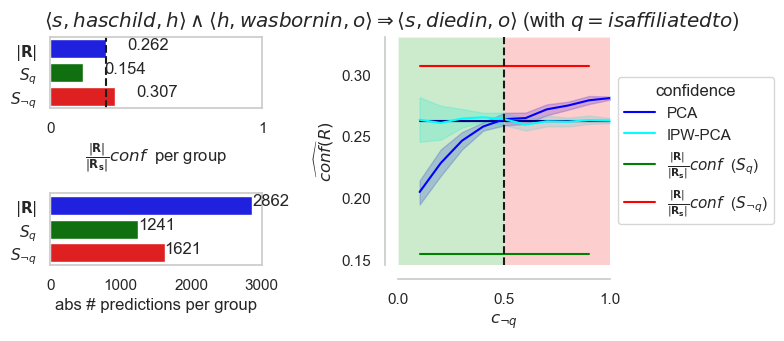

# How to generate the images in the paper

The following are instructions to generate the figures in the experimental section of the paper.

Note: to be able to run these, first you should run the experiments to generate results.

### Non-PCA-based confidence measures for a non-recursive rule under SCAR-per-predicate and SAR-per-group i.f.o. changing known propensity scores (Fig 5)

In the paper, Figure 5 shows the behavior of a single non-recursive rule under SCAR-per-predicate and SAR-per-group 
for the following confidence measures:
* true confidence `conf(R)`,
* Inverse propensity weighted confidence estimator `IPW(R)`,
* CWA-based estimator (*standard confidence*) `CWA(R)`,
* Inverse-c-weighted CWA-based estimator `ICW(R)`

when varying the known propensity scores.
To generate this figure, run the following file:

[cwa_conf_run_yago3_10.py](../artificial_bias_experiments/images_paper_joint/known_prop_scores_cwa_conf/cwa_conf_run_yago3_10.py)

Amongs others, this results in the following file, which is Figure 5 in the paper: 

### PCA-based confidence measures for a non-recursive rule under SCAR-per-predicate and SAR-per group i.f.o. changing known propensity scores (Fig 6)

In the paper, Figure 6 shows the behavior of a single non-recursive rule under SCAR-per-predicate and SAR-per-group 
for the following confidence measures, for both the predicted predicate `p` and its inverse `p^{-1}`:
* true confidence `conf(R)`:
  * unmodified
  * rescaled with bias_{y(s)=0}=\frac{|R|}{|R^{s}_{s}|},
* PCA-based confidence measure `PCA(R)`,
* Inverse propensity weighted PCA estimator `IPW_PCA(R)`,

* when varying the known propensity scores.

To generate this figure, run the following file:

[pca_conf_run_yago3_10.py](../artificial_bias_experiments/images_paper_joint/known_prop_scores_pca_conf/pca_conf_run_yago3_10.py)

Amongs others, this results in the following file, which is Figure 5 in the paper: 

### Effect of the bias_e(s) on the (IPW-)PCA estimators under PCA i.f.o. varying propensity scores (Fig. 7)
Run:
[plot_combo_for_yago3_10_less_detailed.py](../artificial_bias_experiments/known_prop_scores/sar_two_subject_groups/image_generation/group_differences/plot_combo_for_yago3_10_less_detailed.py)

to obtain:

